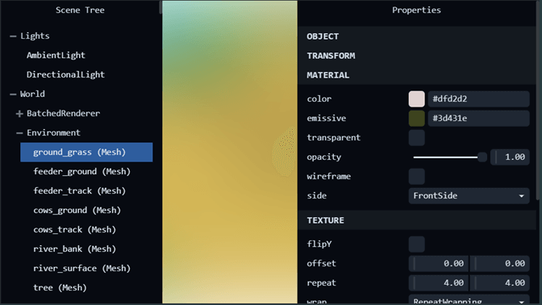

# Three.js Scene Inspector

A debugging tool for Three.js that displays the scene hierarchy and editable object properties using Tweakpane.



## Requirements

- three.js `^0.169.0`
- tweakpane `^4.0.0`

## Installation

```bash
npm install @alexfdr/three-scene-inspector
```

## Usage

```typescript
import { Scene } from 'three';
import { ThreeSceneInspector } from '@alexfdr/three-scene-inspector';

const scene = new Scene();
// ...
const inspector = new ThreeSceneInspector(scene);
```

## Features

### Scene Hierarchy

Displays the full scene tree. Click any node to select it and inspect its properties. The search box filters the tree by object name or type.

### Filtering

Use `excludeFromTree` to hide objects whose display label contains any of the provided strings:

```typescript
inspector.excludeFromTree('mixamorig', 'BatchedRenderer');
```

### Property Inspector

Displays editable properties for the selected object, organized into categories. Add or modify categories by editing `src/properties.ts`.

Use 'addProperties' to add new properties to a one of the existing caterogies:

```typescript
inspector.addProperties('Material', [
  { path: 'material.normalMap', type: 'image', label: 'normal' },
  { path: 'material.bumpMap', type: 'image', label: 'bump' },
]);
```

## Development

```bash
npm install
npm run dev    # Start dev server at http://localhost:5173/
npm run build  # Build library
```

## License

ISC
